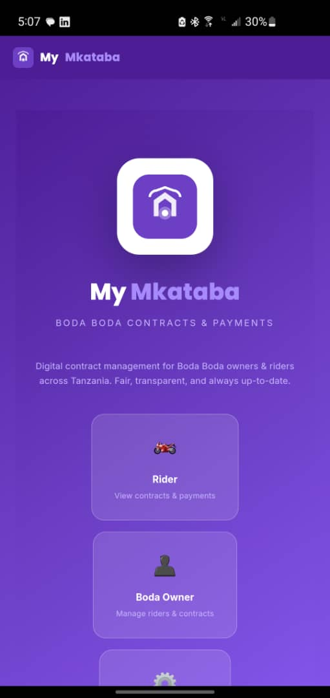

<div align="center">

# 🏍️ My Mkataba

### Boda Boda Contract Management App

**Track contracts, payments, GPS routes, and rider compliance for motorcycle taxi businesses.**


</div>

---

## 📱 App Screenshots

<div align="center">

| Login | Dashboard |
|:-----:|:---------:|
|  |  |

</div>

---

## ✨ Features

- **📋 Contract Management** — Create and track daily rental contracts between boda owners and riders
- **💰 Payment Tracking** — Log daily payments (full/partial/short), auto-calculate balances
- **📍 GPS Monitoring** — Track rider routes during work hours via device GPS
- **👤 Role-Based Dashboards** — Separate views for Admin, Owner, and Rider
- **🔔 Real-time Notifications** — Payment alerts and contract status updates
- **📄 PDF Export** — Download payment receipts directly from mobile
- **📴 Offline-First** — Works offline with Dexie.js (IndexedDB), syncs when online

---

## 🛠️ Tech Stack

| Layer | Technology | Description |
|-------|-----------|-------------|
| **Frontend** | React 19 + Vite | Modern UI with fast HMR |
| **Mobile** | Capacitor 8 | Cross-platform native builds |
| **Database** | Dexie.js (IndexedDB) | Client-side database, works offline |
| **Styling** | Custom CSS | Hand-crafted, no framework bloat |
| **State** | React Context | Lightweight state management |
| **Routing** | React Router | SPA navigation |
| **Android** | Gradle + JDK 17+ | Native Android build |

---

## 👥 Roles

| Role | Access Level |
|------|-------------|
| **🔑 Admin** | Full system control — manage owners, riders, view all data |
| **🏢 Owner** | Manage their riders, track payments, view GPS history |
| **🏍️ Rider** | View assigned contract, submit daily payments, see history |

---

## 🚀 Getting Started

### Web (Development)
```bash
npm install
npm run dev
```

### Android Build
```bash
npm install
npm run build
npx cap sync android
cd android && ./gradlew assembleDebug
```

### Default Login
| Role | Email | Password |
|------|-------|----------|
| Admin | admin@mymkataba.com | 1234 |
| Owner | Create your own account | — |

---

## 📁 Project Structure

```
src/
├── components/     # Reusable UI (Badge, Layout)
├── context/        # Auth context (AuthContext)
├── data/           # Database layer (Dexie.js)
├── pages/          # Route pages (Login, Dashboards)
├── App.jsx         # Router setup
├── main.jsx        # Entry point + back button handler
└── index.css       # Global styles
android/            # Capacitor Android project
screenshots/        # App screenshots
```

---

## 📄 License

**Private** — Abnormal Tech Solutions

<div align="center">

**Built with ❤️ for Boda Boda businesses in Tanzania**

</div>
