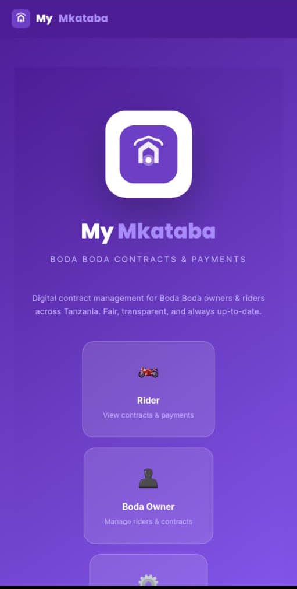
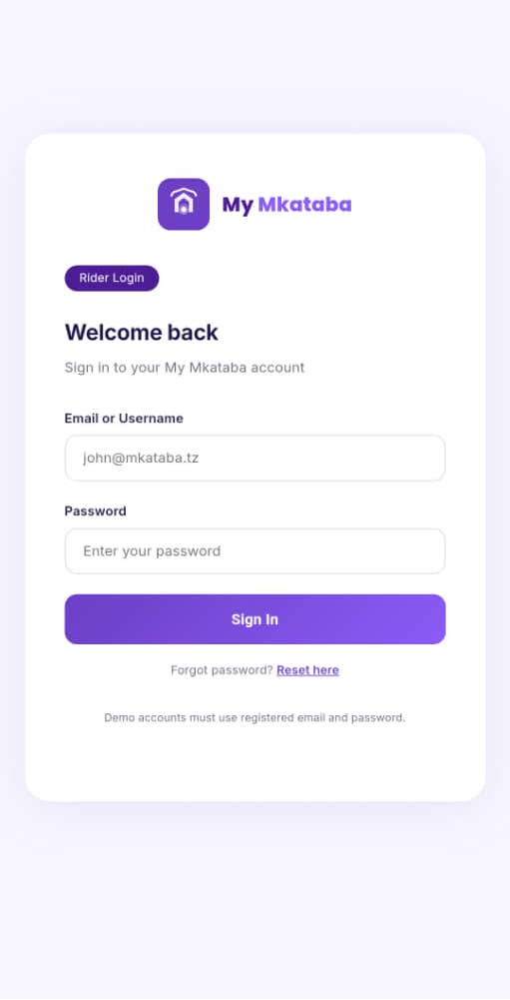

<div align="center">

# 🏍️ My Mkataba

### **Boda Boda Contract Management App**


---

**Track contracts, payments, GPS routes, and rider compliance for motorcycle taxi businesses.**

[](https://github.com/abnormal-yi/my-mkataba/releases/download/v1.0.0/MyMkataba.apk)

</div>

---

## 📱 App Preview

<div align="center">


&nbsp;&nbsp;


</div>

---

## ✨ Features

<div align="center">

| 📋 **Contract Management** | 💰 **Payment Tracking** | 📍 **GPS Monitoring** |
|:--------------------------:|:-----------------------:|:---------------------:|
| Create and track daily rental contracts between boda owners and riders | Log daily payments (full/partial/short), auto-calculate balances | Track rider routes during work hours via device GPS |

| 👤 **Role-Based Dashboards** | 🔔 **Real-time Notifications** | 📄 **PDF Export** |
|:----------------------------:|:------------------------------:|:-----------------:|
| Separate views for Admin, Owner, and Rider | Payment alerts and contract status updates | Download payment receipts directly from mobile |

</div>

---

## 🛠️ Tech Stack

<div align="center">


</div>

| Layer | Technology | Description |
|-------|-----------|-------------|
| **Frontend** | React 19 + Vite | Modern UI with fast HMR |
| **Mobile** | Capacitor 8 | Cross-platform native builds |
| **Database** | Dexie.js (IndexedDB) | Client-side database, works offline |
| **Styling** | Custom CSS | Hand-crafted, no framework bloat |
| **State** | React Context | Lightweight state management |
| **Routing** | React Router | SPA navigation |
| **Android** | Gradle + JDK 17+ | Native Android build |

---

## 👥 Roles

<div align="center">

| Role | Access Level | Icon |
|------|-------------|:----:|
| **Admin** | Full system control — manage owners, riders, view all data | 🔑 |
| **Owner** | Manage their riders, track payments, view GPS history | 🏢 |
| **Rider** | View assigned contract, submit daily payments, see history | 🏍️ |

</div>

---

## 🚀 Getting Started

### Prerequisites

```bash
# Install Node.js (v18+)
# Install npm
# Install Android Studio (for APK build)
```

### Web (Development)

```bash
# Clone the repository
git clone https://github.com/abnormal-yi/my-mkataba.git

# Navigate to project
cd my-mkataba

# Install dependencies
npm install

# Start development server
npm run dev
```

### Android Build

```bash
# Build for production
npm run build

# Sync with Capacitor
npx cap sync android

# Build Android APK
cd android
./gradlew assembleDebug
```

### Default Login

| Role | Email | Password |
|------|-------|----------|
| Admin | admin@mymkataba.com | 1234 |
| Owner | Create your own account | — |

---

## 📁 Project Structure

```
my-mkataba/
├── src/
│   ├── components/     # Reusable UI (Badge, Layout)
│   ├── context/        # Auth context (AuthContext)
│   ├── data/           # Database layer (Dexie.js)
│   ├── pages/          # Route pages (Login, Dashboards)
│   ├── App.jsx         # Router setup
│   ├── main.jsx        # Entry point + back button handler
│   └── index.css       # Global styles
├── android/            # Capacitor Android project
├── screenshots/        # App screenshots
├── package.json        # Dependencies
└── README.md           # This file
```

---

## 🤝 Contributing

Contributions are welcome! Please feel free to submit a Pull Request.

1. Fork the Project
2. Create your Feature Branch (`git checkout -b feature/AmazingFeature`)
3. Commit your Changes (`git commit -m 'Add some AmazingFeature'`)
4. Push to the Branch (`git push origin feature/AmazingFeature`)
5. Open a Pull Request

---

## 📄 License

**Private** — Abnormal Tech Solutions

---

## 📥 Download APK

<div align="center">

[](https://github.com/abnormal-yi/my-mkataba/releases/download/v1.0.0/MyMkataba.apk)

> **Note:** You may need to enable "Install from unknown sources" in your Android settings.

</div>

---

<div align="center">

**Built with ❤️ for Boda Boda businesses in Tanzania**


</div>
